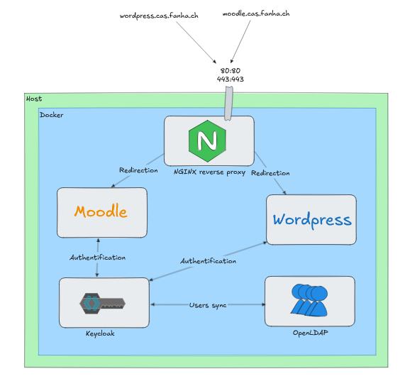

# CAS
Central Authentication Service

Les fichiers nécessaire sont disponible à l'adresse suivante : [https://github.com/YFanha/CAS](https://github.com/YFanha/CAS)

# Infrastructure



# Reverse proxy
J'ai utilisé [Nginx Proxy Manager](https://nginxproxymanager.com/) afin de simplifier la gestion des hôtes.
```yaml
  nginxproxymanager:
    image: 'jc21/nginx-proxy-manager:latest'
    restart: unless-stopped
    environment:
      DisableIPv6: 'true'
    ports:
      - '80:80'
      - '443:443'
      - '81:81' # Admin Web Portal
    volumes:
      - ./data:/data
      - ./letsencrypt:/etc/letsencrypt
```

L'infrastructure étant hébergée chez moi, j'ai redirigé les ports 80 et 443 sur l'hôte afin de gérer ensuite le traffic HTTP/S avec le reverse proxy. Example de la création d'un hôte :


## SSL


# Keycloak
## Création d'un nouveau REALM


## Importation des utilisateurs LDAP


## Vérification


*Via phpldapadmin*
## Trouver les différents endpoints (nécessaire pour la suite)
![[Pasted image 20250317141041.png]]

# Wordpress
>  https://wordpress.cas.fanha.ch
## Ajout du client sur keycloak


## Ajout du plugin


## Configuration du plugin
> **Authorize Endpoint** : https://keycloak.cas.fanha.ch/realms/fanha/protocol/openid-connect/auth  
> **Access Token Endpoint :** https://keycloak.cas.fanha.ch/realms/fanha/protocol/openid-connect/token  


**To find the Client secret, go to the keycloak server WebUI > Client > the client > credentials**


## Tests


# Moodle
> https://moodle.cas.fanha.ch
## Ajout du client sur keycloak

![[Pasted image 20250317135819.png]]
## Configuration sur Moodle
![[Pasted image 20250317140307.png]]![[Pasted image 20250317140328.png]]

![[Pasted image 20250317140543.png]]


**To find the Client secret, go to the keycloak server WebUI > Client > the client > credentials**

![[Pasted image 20250317141718.png]]![[Pasted image 20250317141948.png]]

## Activer et tester la configuration
> Sous `Site administration` > `Plugins` > `Authentication` > `Manage Authentication`


![[Pasted image 20250317142128.png]]

![[Pasted image 20250317142143.png]]
### Lors du login :
![[Pasted image 20250317142345.png]]

# 2FA
Keycloak possède déjà la fonction "2FA". Il suffit donc d'aller dans les utilisateurs souhaités et séléctionner `Configure OTP` dans `Required user actions`
![[Pasted image 20250317143417.png]]![[Pasted image 20250317143507.png]]